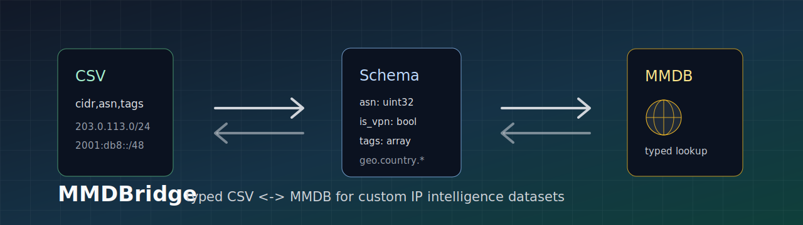

# MMDBridge

MMDBridge is a schema-driven CSV <-> MMDB bridge for custom IP intelligence datasets. It converts flat tables of IP/CIDR ranges into typed MaxMind DB files, and exports MMDB contents back into stable CSV for review, diffing, enrichment, and database import workflows.

<p align="center">
  
</p>

<p align="center">
  
  
  
  
  
  
</p>

---

## Overview

Security, fraud, network, and infrastructure teams often keep IP intelligence in CSV exports, warehouse tables, spreadsheet workflows, or internal control planes. Production systems usually want a compact lookup database with stable runtime semantics.

MMDBridge provides the bridge between those layers:

```text
CSV / table export + YAML schema -> typed MMDB
typed MMDB + YAML schema        -> diff-friendly CSV
```

The schema is the contract. It defines the network column, field types, nested MMDB paths, array splitting, required fields, and MMDB metadata. Builds are reproducible by default and do not depend on external feeds.

## System Behavior

MMDBridge reads a CSV with one IP address or CIDR prefix per row, converts configured columns into MaxMind DB data types, assembles nested records from dotted paths, and writes a MaxMind DB file using the official Go writer.

The reverse path walks all networks in an MMDB, extracts fields declared by the same schema, and writes a deterministic CSV projection suitable for code review, audit logs, regression tests, and downstream data pipelines.


## Features

| Area | Capability |
| --- | --- |
| Typed conversion | `string`, `bool`, `int32`, `uint16`, `uint32`, `uint64`, `float32`, `float64`, `string_array` |
| Nested records | Map flat CSV columns to paths such as `geo.country.iso_code` |
| Bidirectional workflow | Build MMDB from CSV and export MMDB back to CSV |
| Deterministic metadata | Fixed `build_epoch` support for reproducible artifacts |
| IPv4 / IPv6 | Build IPv4-only or mixed IPv4/IPv6 databases |
| Array fields | Split CSV cells into string arrays with a configured delimiter |
| Operational fit | Works in CI, release jobs, data pipelines, and local review workflows |

## Quick Start

```sh
git clone https://github.com/ipanalytics/mmdbbridge.git
cd mmdbbridge

go test ./...
go build -o mmdbbridge ./cmd/mmdbbridge

./mmdbbridge build \
  --schema examples/custom-intel.yaml \
  --csv examples/custom-intel.csv \
  --out custom-intel.mmdb

./mmdbbridge export \
  --schema examples/custom-intel.yaml \
  --mmdb custom-intel.mmdb \
  --out exported.csv
```

## Installation

### From Go

```sh
go install github.com/ipanalytics/mmdbbridge/cmd/mmdbbridge@latest
```

### From Source

```sh
git clone https://github.com/ipanalytics/mmdbbridge.git
cd mmdbbridge
go test ./...
go build -o mmdbbridge ./cmd/mmdbbridge
```

## Usage

### Build An MMDB

```sh
mmdbbridge build \
  --schema examples/custom-intel.yaml \
  --csv examples/custom-intel.csv \
  --out custom-intel.mmdb
```

Input CSV:

```csv
cidr,asn,is_vpn,country,tags
203.0.113.0/24,64500,true,US,vpn|hosting
2001:db8:42::/48,64501,false,DE,enterprise|office
```

Schema:

```yaml
network:
  column: cidr

metadata:
  database_type: custom-ip-intel
  description: Custom IP intelligence dataset
  ip_version: 6
  record_size: 28
  build_epoch: 1
  include_reserved_networks: true

fields:
  asn:
    column: asn
    type: uint32
  is_vpn:
    column: is_vpn
    type: bool
  geo.country.iso_code:
    column: country
    type: string
  tags:
    column: tags
    type: string_array
    split: "|"
```

Record produced for `203.0.113.1`:

```json
{
  "asn": 64500,
  "is_vpn": true,
  "geo": {
    "country": {
      "iso_code": "US"
    }
  },
  "tags": ["vpn", "hosting"]
}
```

### Export An MMDB

```sh
mmdbbridge export \
  --schema examples/custom-intel.yaml \
  --mmdb custom-intel.mmdb \
  --out exported.csv
```

Output CSV:

```csv
cidr,asn,country,is_vpn,tags
2001:db8:42::/48,64501,DE,false,enterprise|office
203.0.113.0/24,64500,US,true,vpn|hosting
```

### Generate A Schema Template

```sh
mmdbbridge schema --out schema.yaml
```

## Commands

| Command | Purpose |
| --- | --- |
| `mmdbbridge build --schema schema.yaml --csv input.csv --out output.mmdb` | Compile a CSV into an MMDB |
| `mmdbbridge export --schema schema.yaml --mmdb input.mmdb --out output.csv` | Export an MMDB projection to CSV |
| `mmdbbridge schema --out schema.yaml` | Write a starter schema |

## Data Format

### Network Column

`network.column` names the CSV column containing an IP address or CIDR prefix.

```yaml
network:
  column: cidr
```

Host addresses are normalized to `/32` for IPv4 and `/128` for IPv6. CIDR prefixes are canonicalized before insertion.

### Metadata

| Key | Description |
| --- | --- |
| `database_type` | MMDB database type string |
| `description` | English metadata description |
| `ip_version` | `4` or `6`; use `6` for mixed IPv4/IPv6 data |
| `record_size` | MMDB record size: `24`, `28`, or `32` |
| `build_epoch` | Unix timestamp embedded in metadata |
| `include_reserved_networks` | Allows documentation, private, and reserved ranges |

### Fields

Each entry under `fields` maps an MMDB path to a CSV column and explicit type.

```yaml
fields:
  risk.score:
    column: risk_score
    type: uint16
    required: true
  labels:
    column: labels
    type: string_array
    split: "|"
```

Supported types:

| Type | Notes |
| --- | --- |
| `string` | UTF-8 string value |
| `bool` | Parsed with Go boolean semantics |
| `int32` | Signed 32-bit integer |
| `uint16` | Unsigned 16-bit integer |
| `uint32` | Unsigned 32-bit integer |
| `uint64` | Unsigned 64-bit integer |
| `float32` | 32-bit floating point |
| `float64` | 64-bit floating point |
| `string_array` | Delimited string list |

## Outputs And Artifacts

| Artifact | Producer | Consumer |
| --- | --- | --- |
| `.mmdb` | `build` | Runtime lookup services, API gateways, enrichment jobs |
| `.csv` | `export` | Review tools, Git diffs, warehouses, spreadsheets |
| `.yaml` | `schema` | CI jobs, data pipelines, release processes |

MMDB output is suitable for standard MaxMind DB readers. CSV output is stable enough for pull request review and downstream ingestion, provided the schema is kept under version control.

## Operational Notes

- Keep schemas versioned with the datasets they describe.
- Use a fixed `metadata.build_epoch` for byte-stable release artifacts.
- Prefer explicit columns over type inference in production pipelines.
- Run `mmdbbridge export` in CI when reviewing generated MMDB changes.
- Store source CSVs or upstream extract jobs separately from generated MMDB artifacts.

<details>
<summary>CI example</summary>

```yaml
name: mmdbbridge

on:
  pull_request:
    paths:
      - "data/**"
      - "schemas/**"

jobs:
  build-mmdb:
    runs-on: ubuntu-latest
    steps:
      - uses: actions/checkout@v4
      - uses: actions/setup-go@v5
        with:
          go-version: "1.22"
      - run: go install github.com/ipanalytics/mmdbbridge/cmd/mmdbbridge@latest
      - run: |
          mmdbbridge build \
            --schema schemas/ip-intel.yaml \
            --csv data/ip-intel.csv \
            --out dist/ip-intel.mmdb
```

</details>

## Project Scope

MMDBridge focuses on schema-governed conversion between tabular IP datasets and MMDB files.

In scope:

- CSV input and output.
- YAML schemas.
- Typed MMDB record construction.
- Nested map construction from dotted field paths.
- Deterministic build metadata.
- Local, CI, and data-pipeline execution.

Planned work:

- configurable overlap policy for conflicting networks;
- merge/enrichment mode against a base MMDB;
- schema validation output designed for CI annotations;
- Parquet input and export.

## Use Cases

| Team | Example |
| --- | --- |
| Security engineering | Build private VPN, proxy, scanner, or abuse intelligence databases |
| Fraud and risk | Ship custom IP risk attributes to low-latency lookup services |
| Network operations | Convert allocation, ASN, region, or routing metadata into MMDB |
| Data engineering | Round-trip MMDB datasets through CSV review and warehouse jobs |
| Research | Create reproducible MMDB artifacts from published or internal measurements |

## Limitations

- CSV is the supported tabular format in the current implementation.
- Overlapping networks currently use the writer's default replacement behavior.
- Export projects fields declared in the schema; undeclared MMDB fields are not emitted.
- The tool does not bundle third-party IP intelligence feeds.

## Directory Structure

```text
.
├── cmd/mmdbbridge/          # CLI entrypoint
├── examples/                # Example schema and CSV input
├── internal/bridge/         # CSV/MMDB build and export logic
├── internal/schema/         # YAML schema model and validation
├── site/                    # README and project visual assets
├── go.mod
└── README.md
```

## Deployment

MMDBridge is distributed as a single Go binary. It has no runtime service dependency and fits common release patterns:

| Environment | Pattern |
| --- | --- |
| Local workstation | Build and inspect custom datasets before committing |
| CI | Compile MMDB artifacts from reviewed CSV/schema inputs |
| Release job | Publish `.mmdb` files as versioned build artifacts |
| Data pipeline | Convert scheduled table exports into runtime lookup databases |
| Container image | Package the binary with schemas and source datasets for repeatable builds |

Minimal container build:

```dockerfile
FROM golang:1.22 AS build
WORKDIR /src
COPY . .
RUN go build -o /out/mmdbbridge ./cmd/mmdbbridge

FROM gcr.io/distroless/base-debian12
COPY --from=build /out/mmdbbridge /usr/local/bin/mmdbbridge
ENTRYPOINT ["/usr/local/bin/mmdbbridge"]
```

## Documentation

- Example schema: [`examples/custom-intel.yaml`](./examples/custom-intel.yaml)
- Example CSV: [`examples/custom-intel.csv`](./examples/custom-intel.csv)
- MaxMind DB format: [maxmind/MaxMind-DB](https://github.com/maxmind/MaxMind-DB)
- Go writer library: [maxmind/mmdbwriter](https://github.com/maxmind/mmdbwriter)

## License

Apache License 2.0. See [`LICENSE`](./LICENSE).

## Disclaimer

MMDBridge is infrastructure tooling for user-provided datasets. Validate source data, schema changes, and generated artifacts before using them in production decision paths.
